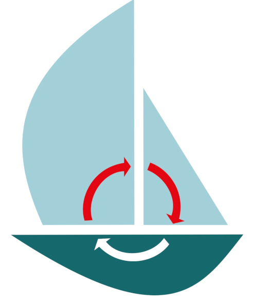
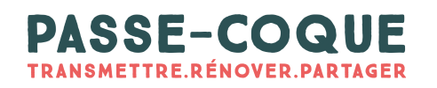

# Asso Passe-Coque

<table>
<tr>
<td style="vertical-align: top;">
  
  
</td>
<td style="vertical-align: top;">
Web site of the Passe-Coque association, and some code repo too.  

Front-end, back-end, the full stack!  

The code used for the site is in the `web-site` folder.
</td>
</tr>
</table> 

## Get started

- Developper Guide [here](./admin/HOW-TO.md)

### Misc commands and hints
If `NodeJS` is installed on your dev machine:
```
$ cd web-site
$ npm start
```
There is in the `web-site` folder a `package.json`, used by `npm start`. The server will start on port `8080`, then you can reach
<http://localhost:8080/> in your browser.

Or using `php`:
```
$ php -S 127.0.0.1:8000    
```
then reach <http://localhost:8000/> in your browser.

Installing MySQL will allow you to setup a full development environment locally.  
[Setup MySQL](https://www.prisma.io/dataguide/mysql/setting-up-a-local-mysql-database#setting-up-mysql-on-macos) locally.  
See [here](web-site/admin/sql/create.passe-coque.schema.sql) for more details about the DB schema.

---
