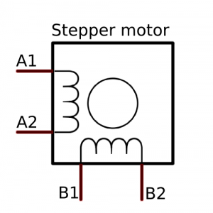
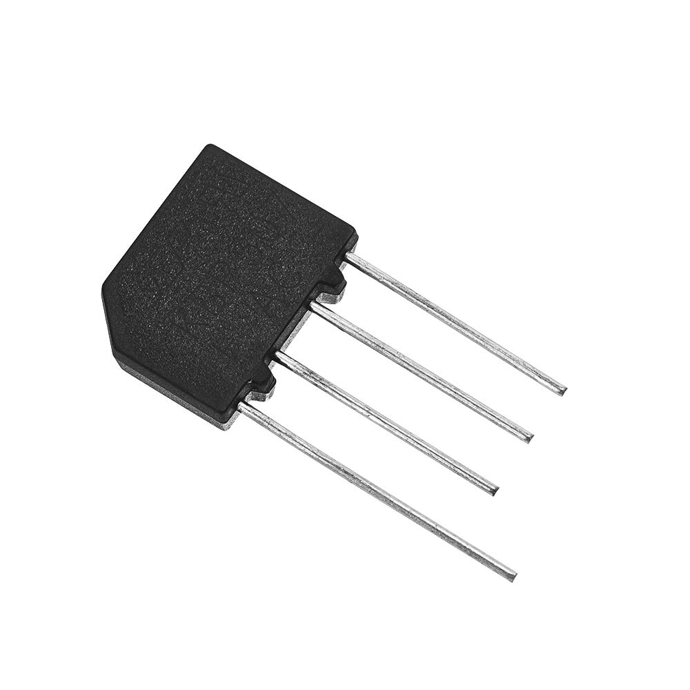
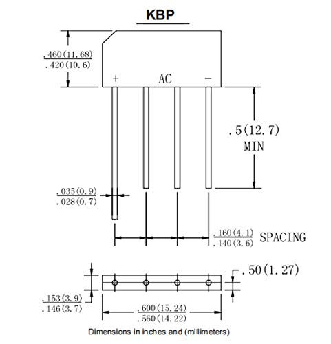
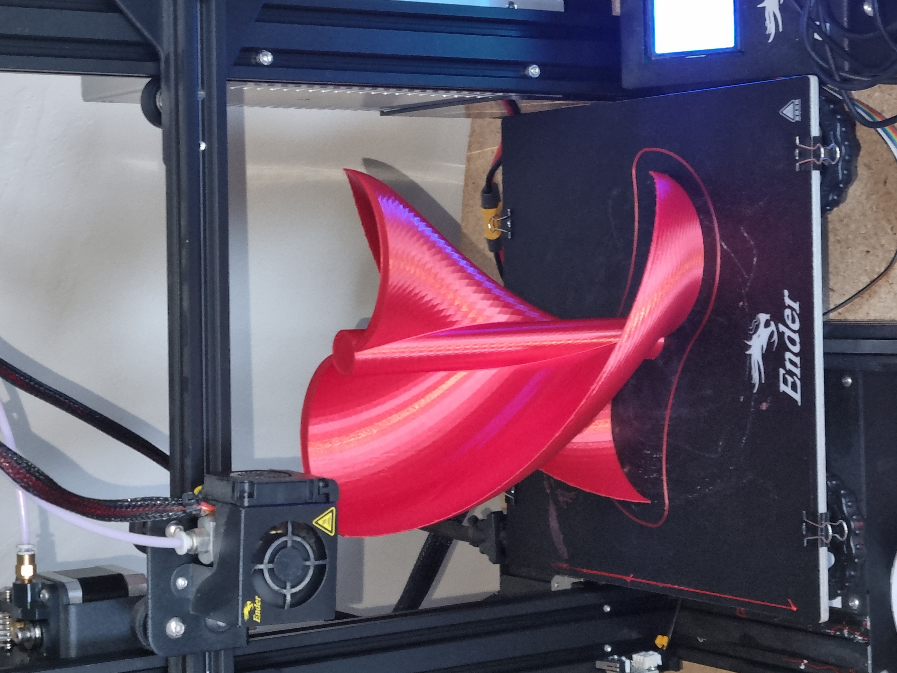
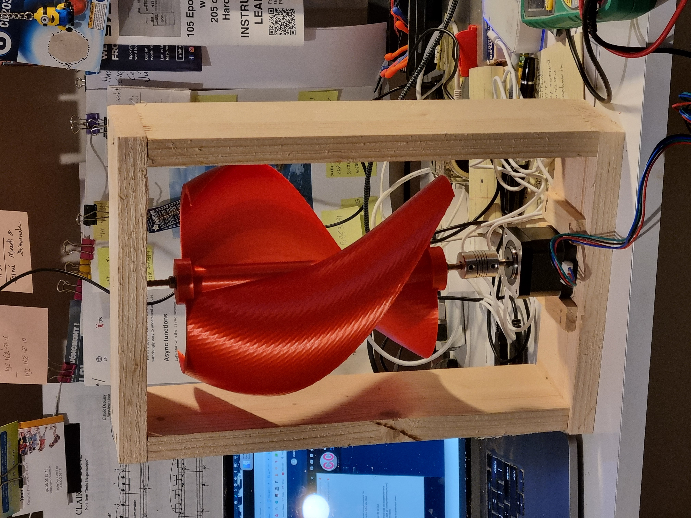

[French version](./README_fr.md)

# Wind Generator
## Based on a stepper motor

We want to use the wind energy to store 5V current in a powerbank, or such kind of storage.

Many such examples exist on the Internet.
- [All About Converting Stepper Motors To Generators](https://www.youtube.com/watch?v=-zCTggoh994&t=102s)
- [LowTech lab: Wind Turbine](https://wiki.lowtechlab.org/wiki/L%27%C3%A9olienne/en-gb)
- [Using Stepper Motors as Generators (Rectifiers, KBP 307 IC, & Alternatives)](https://www.youtube.com/watch?v=58XnKt1BxV0) 
- [How to Recycle Soda Cans Into a Wind Turbine!](https://www.instructables.com/How-to-Recycle-Soda-Cans-Into-a-Wind-Turbine-Gener/)
- And more!..

They're all good, but I could not find ALL I was looking for in a single one.  
So, here is my version of the setup.

### Stepper motors
There are many kinds of stepper motors.  
They're all made of coils, and magnets.  

Here is the cool thing about those motors:  
- When you provide current to a stepper motor, it will rotate.  
- And when you rotate a stepper motor, it will provide current !  
    - This is here what we're interested in.
    - And yes, it's like the dynamo I had on my bike, back in... the days.

We will use here a simple stepper motor - NEMA 17, made of two coils - hence the four wires, that can be represented this way:

The stepper motors I use look like the above, and come with a four-wire cable.  
Using a multi-meter, it is very easy to find the couples (`A1`, `A2`) and (`B1`, `B2`), mentionned on the diagram above. 

> Interestingly, when you rotate the motor, the pins (`A1`, `A2`) will provide Alternative Current (AC), **_as well as the pins (`B1`, `B2`)_**. It works like a small alternator.   
A four-wire stepper motor will provide **_TWO_** AC Outputs.  
> Those _**two**_ outputs can be used as two sources, serially, or in parallel, as we'll see.

As the motor rotation will produce alternative current, we will need and use a _rectifier_ to make it a positive-only current output.  
The rectifier can be built with four diodes, and it would work fine. But here - in order to make it even easier - we will use a _rectfier bridge_, like a `KBP 307 IC`, or a `B17-18-A-03`.

As the tension of the output is proportionnal to the rotation speed, we will need:
- A capacitor to smooth it down.
- A tension regulator to finally get a 5V output (as expected here).

> _Note_: The rectifier bridge (like a `KBP 307 IC`) is **NOT** represented on the diagram above. It looks like this:  

| Picture | Schema |
|:-------:|:------:|
|  |  |

The AC current enters through the 2 internal pins. Rectified current flows
through the external pins. Positive on the bevel side (left here), Ground on the other (on the right here).

> On the diagram above, note that there is only one coil conected. The same can be done with the second one.  
> Then it is your choice to use a serial or parallel setting.  
> Here we'd rather use a parallel one, to keep the voltage to 5V.
> The output would go to some 5V storage, like powerbank or so, like
> - [PowerBank](https://www.arrow.com/en/products/1565/adafruit-industries)
> - [PowerBoost](https://www.adafruit.com/product/1944)
> - etc...

#### BOM
Bill of Materials, for the electronic part.
- Stepper motor `NEMA 17`
- Rectifier Bridge, like `KBP 307 IC` (one per coil)
- A 1000&micro;F 25V capacitor (one per coil)
- A Voltage regulator, 5V output, like a `L7805` (one per coil)

All those components can be found easily from your favorite providers (Amazon, AliBaba, AllSpectrum, Adafruit, SparkFun, SeeedStudio, Parallax, RobotShop, ServoCity, ...)

### 3D printed part - The turbine itself
We started from the code at <https://www.thingiverse.com/thing:2241699>, where the `spiraltest04.scad` comes from.  
We've created extra parts for hold the turbine in place, see the code in `version.01.scad`.

- [STL](./3D/spiraltest04.stl) for the turbine
- [STL](./3D/version.01.bottom.stl) for the axis (top and bottom)

#### Horizontal axis? Vertical axis?
The problem is the following one:  
- With a vertical axis 
    - Half the turbine is rotating downwind
    - The other half _against_ the wind (aka upwind).
    - The efficiency of the turbine is not at its top...
    - But the rotation can be directly transmitted to the motor, that can be _fixed_ on the base, as it is independant of the direction of the wind.
- With an horizontal axis
    - The turbine will have to be facing the wind to be efficient (like a wind vane), in which case all its blades are generating power (no blade is turning against the wind), its efficiency is on top.
    - Thus, for the location of the motor to be independant of the direction of the wind, to motor must rotate at the same time as the turbine changes direction, it would be attached to the same segment as the one holding the axis of the turbine.
    - **_BUT_** a new problem arises: how to transmit the current produced by the motor to the battery (without loosing too much energy)? The battery cannot really be located next to the motor... There must be some kind of "rotating contact", that will prevent wires from wrapping around the pole of the turbine...

In other words:
- How much wind power do we lose with a vertical axis?
- How much current to we lose with an horizontal axis?

[Several Options](https://all3dp.com/2/3d-printed-wind-turbines-wind-powered-gadgets/)

#### Transmitting the rotation, or the current?
`To come`.

## Different settings
Options at work.  
Never ending job!..

### Very first one
Now we're talking.  

That one has the stepper at the very bottom - obviously - and there is a ball bearing at the top.  
The goal here is to see if the turbine can generate enough power to spin the motor fast enough...  
The wooden frame is here to speed up the tests.  

<!-- https://youtube.com/shorts/j9USgp5iNnw -->
See a [video](https://youtube.com/shorts/j9USgp5iNnw)  of the turbine, in the wind.  
No motor connected yet.

More soon!

## Other resources
- [phileole](https://phileole.com/en/homepage/)
- . . .

---

