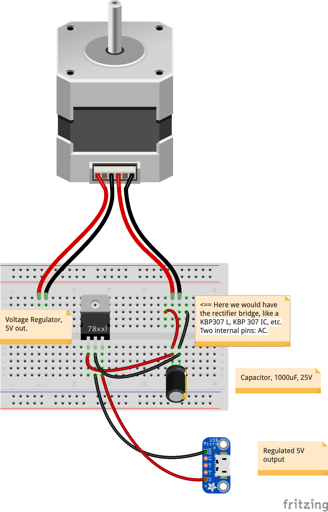

# Wind Generator
## Based on a stepper motor

Many such examples exist on the Internet.
- [All About Converting Stepper Motors To Generators](https://www.youtube.com/watch?v=-zCTggoh994&t=102s)
- [LowTech lab: Wind Turbine](https://wiki.lowtechlab.org/wiki/L%27%C3%A9olienne/en-gb)
- [Using Stepper Motors as Generators (Rectifiers, KBP 307 IC, & Alternatives)](https://www.youtube.com/watch?v=58XnKt1BxV0)
- And more!..

They're all good, but I could not find ALL I was looking for in a single one.  
So, here is my version of the setup.

### Stepper motors
There are many kinds of stepper motors.  
They're all made of coils, and magnets.  

Here is the cool thing about those motors:  
- When you provide current to a stepper motor, it will rotate.  
- And when you rotate a stepper motor, it will provide current !  
    - This is here what we're interested in.

We will use here a simple stepper motor, made of two coils - hence four wires, that can be represented this way:

The stepper motors I use look like the above, and come with a four-wire cable.  
Using a multi-meter, it is very easy to find the couples (`A1`, `A2`) and (`B1`, `B2`), mentionned on the diagram above. 

> Interestingly, when you rotate the motor, the pins (`A1`, `A2`) will provide Alternative Current (AC), **_as well as the pins (`B1`, `B2`)_**. It works like a small alternator.   
A four-wire stepper motor will provide **_TWO_** AC Outputs.  
> Those _**two**_ outputs can be used as two sources, serially, or in parallel, as we'll see.

As the motor rotation will produce alternative current, we will need and use a _rectifier_ to make it a positive-only current output.

As the tension of the output is proportionnal to the rotation speed, we will need:
- A capacitor to smooth it down.
- A tension regulator to finally get a 5V output (as expecte here).

> On the diagram above, note that there is only one coil conected. The same can be done with the second one.  
> Then it is your choice to use a serial or parallel setting.  
> Here we'd rather use a parallel one, to keep the voltage to 5V.
> The output would go to some 5V storage, like powerbank or so, like
> - [PowerBank](https://www.arrow.com/en/products/1565/adafruit-industries)
> - [PowerBoost](https://www.adafruit.com/product/1944)
> - etc...

### The turbine itself

#### Horizontal axis ? Vertical axis ?

#### Transmitting the rotation, or the current ?

## Other resources
- [phileole](https://phileole.com/en/homepage/)
